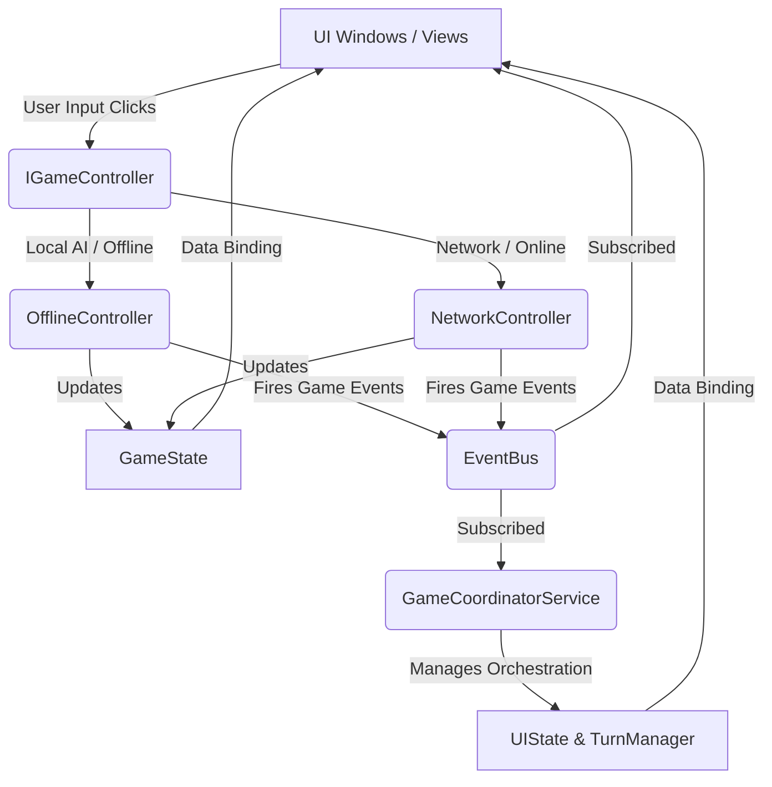

# Fae Light Cards Plugin Architecture

This document outlines the architectural design of the **Fae Light Cards** FFXIV card game plugin. The architecture emphasizes decoupling, single-responsibility, and event-driven workflows.

---

## 1. High-Level Architecture Overview

The plugin follows a modern **Controller-Coordinator-State-View** pattern.
- **State**: Pure data containers (`GameState`, `UIState`, `TurnManager`).
- **Controllers**: Responsible for intent and network/local actions (`OfflineController`, `NetworkController`).
- **Coordinator**: `GameCoordinatorService` bridges the gap between state changes, rendering rules, and side effects.
- **Views**: ImGui windows (`HandWindow`, `PromptWindow`, `OverlayWindow`, etc.) that render the current state.
- **EventBus**: Facilitates decoupled cross-system communication (e.g., triggering a sound, sliding a card).



---

## 2. Core Codebase Components

### Domain Models & State
* **[Card.cs](file:///mnt/sativa/ffxiv_card_game/Models/Card.cs)**: Represents a single playing card with `Suit` and `Rank` enums, display character rendering, and filename helper methods.
* **[GameState.cs](file:///mnt/sativa/ffxiv_card_game/Models/GameState.cs)**: Holds the raw game state. Lists of `Player` records, the pyramid layout, matched cards, and tracks the current active phase/mode. Zero dependencies on UI.
* **[UIState.cs](file:///mnt/sativa/ffxiv_card_game/Models/UIState.cs)**: Tracks visual-only transients: overlay messages, prompt animations, layout scaling, and conveyor belt states.
* **[TurnManager.cs](file:///mnt/sativa/ffxiv_card_game/Services/TurnManager.cs)**: Manages timing-based transitions (e.g. NPC thinking timers, dealer delay transitions) before the actual `GameState` phase progresses.

### Orchestration & Rules
* **[Plugin.cs](file:///mnt/sativa/ffxiv_card_game/Plugin.cs)**: The Dalamud entry point. Acts **strictly** as a Dependency Injection (DI) container, bootstrapper, and window registrar. It delegates all game loops to `GameCoordinatorService`.
* **[GameCoordinatorService.cs](file:///mnt/sativa/ffxiv_card_game/Services/GameCoordinatorService.cs)**: The central orchestration engine. It ticks timers, evaluates end-game conditions, schedules UI animations (like dealing cards), and triggers game state mutations.
* **[RulesEngine.cs](file:///mnt/sativa/ffxiv_card_game/Services/RulesEngine.cs)**: Contains the pure logic evaluating player guesses against deck outcomes for all phases.
* **[EventBus.cs](file:///mnt/sativa/ffxiv_card_game/Services/EventBus.cs)**: A decoupled pub/sub system mapping game events (e.g. `CardDealt`, `LocalCardMatched`) to UI callbacks (e.g. particle emissions, sound effects).

### Controllers
* **[IGameController.cs](file:///mnt/sativa/ffxiv_card_game/Controllers/IGameController.cs)**: Interface abstracting the underlying action executor.
* **[OfflineController.cs](file:///mnt/sativa/ffxiv_card_game/Controllers/OfflineController.cs)**: Executes single-player game rules, manages NPC AI timers/decisions, handles automated dealer mechanics, and applies immediate logic.
* **[NetworkController.cs](file:///mnt/sativa/ffxiv_card_game/Controllers/NetworkController.cs)**: Designed to send actions to a remote server and process incoming authoritative state broadcasts.

### Views (ImGui Render Windows)
* **[OverlayWindow.cs](file:///mnt/sativa/ffxiv_card_game/Windows/OverlayWindow.cs)**: Renders non-interactive, transient elements like win/lose banners, "must ride the bus" overlays, and the top conveyor belt.
* **[PromptWindow.cs](file:///mnt/sativa/ffxiv_card_game/Windows/PromptWindow.cs)**: Manages the interactive prompt dialogs, choices, and state-machine-driven prompt transition animations.
* **[TavernTableWindow.cs](file:///mnt/sativa/ffxiv_card_game/Windows/TavernTableWindow.cs)**: Renders the circular player avatar positions, thinking indicators, and action logs.
* **[PlayersWindow.cs](file:///mnt/sativa/ffxiv_card_game/Windows/PlayersWindow.cs)**: Renders the sidebar scoreboard (drinks taken/given, cards left).
* **[PyramidWindow.cs](file:///mnt/sativa/ffxiv_card_game/Windows/PyramidWindow.cs)**: Renders the phase 2 grid of flipped/unflipped cards.
* **[HandWindow.cs](file:///mnt/sativa/ffxiv_card_game/Windows/HandWindow.cs)**: Manages delta-time sliding animations for cards dealt, discarded, or glided to matching slots, along with particle emitters (fireworks/sparks).

---

## 3. How Game Logic Ticks and Renders

The main loop runs on the Dalamud UI framework's `Draw` loop:

1. **Top-level Update**: `Plugin.DrawUI()` calls `GameController.Update(dt)` and `GameCoordinator.Update(dt)`.
2. **Controller Tick**: `OfflineController` counts down NPC timers, evaluates AI actions, and immediately mutates `GameState` or fires `EventBus` payloads.
3. **Coordinator Tick**: `GameCoordinatorService` ticks global visual timers (e.g. phase transition delays) and updates `UIState` visual state machines.
4. **Window Passes**: The ImGui Windows read the `GameState` and `UIState` synchronously and output ImGui draw commands. Any complex animations (like cards flying) interpolate their coordinates based on DeltaTime during the `Draw` call.

---

## 4. Networking Architecture (Wiring up NetworkController)

To run in multiplayer, `NetworkController` replaces `OfflineController`. The architecture expects an authoritative server model.

### Client-to-Server Intent
The client should connect to a Rust/Node server. When a user clicks a button, `NetworkController` serializes an intent and sends it to the server.
* `HandlePlayerGuess(int choice)` -> `{"action": "PlayerGuess", "choice": X}`
* `HandleFlipPyramidCard()` -> `{"action": "FlipPyramidCard"}`

*The client does NOT immediately mutate state or spawn animations, it waits for server validation.*

### Server-to-Client State Broadcasts
The Server maintains the canonical `GameState`. It broadcasts events down to all connected clients:
```json
{
  "event": "StateUpdate",
  "activePhase": "Accumulation",
  "players": [...]
}
```
### Bridging Network Updates to Visuals
Since the server sends instantaneous updates, the `NetworkController` polls the inbound packet queue during `Update(dt)`. When a specific action occurs (e.g., a card is drawn), the `NetworkController` manually triggers the `EventBus` so the client-side UI fires the deal animation before updating the static hand state. 
This event-driven model ensures decoupling between the raw server packets and the visual fireworks drawn in `HandWindow`.
